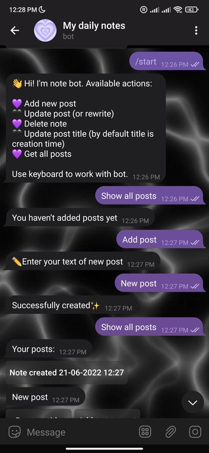
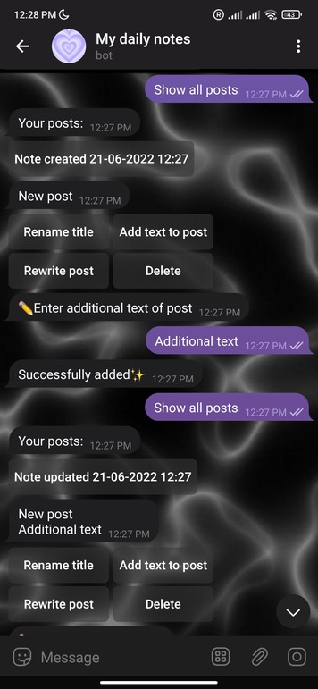
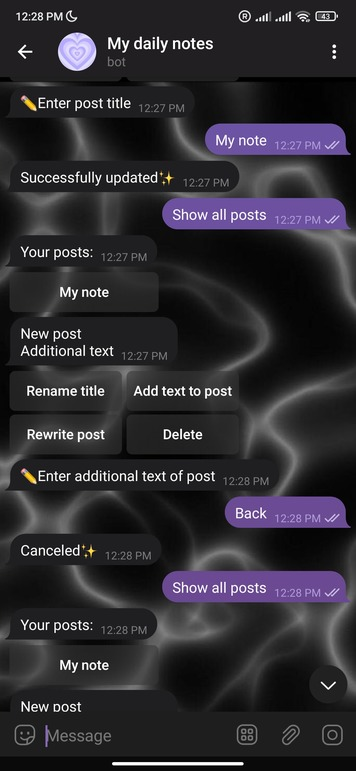
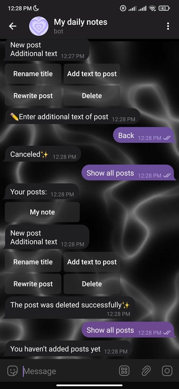

# Telegram bot for notes

## About
This is a telegram bot to manage notes.

#### Available functions:
* Add new post
* Update post (or rewrite)
* Delete note
* Update post title (by default title is creation time in format "Note created/updated dd-MM-yyyy HH:mm")
* Get all posts

## Interaction with bot 

## Technologies

#### Frameworks & libraries:
* [Spring Boot](https://spring.io/projects/spring-boot)
* [Spring Data JPA](https://spring.io/projects/spring-data-jpa)
* [Hibernate](https://hibernate.org/)
* [Lombok](https://projectlombok.org/)
* [Telegram Bot API](https://core.telegram.org/bots/api)
* [Feign](https://docs.spring.io/spring-cloud-openfeign)

Feign is used to set webhook.

#### Database:
* [PostgreSQL](https://www.postgresql.org/)

The database is used to save the notes, main information about user and 
the state of the bot for each user.
* [Liquibase](https://www.liquibase.org/)

#### Build Tool:
* [Maven](https://maven.apache.org/)
